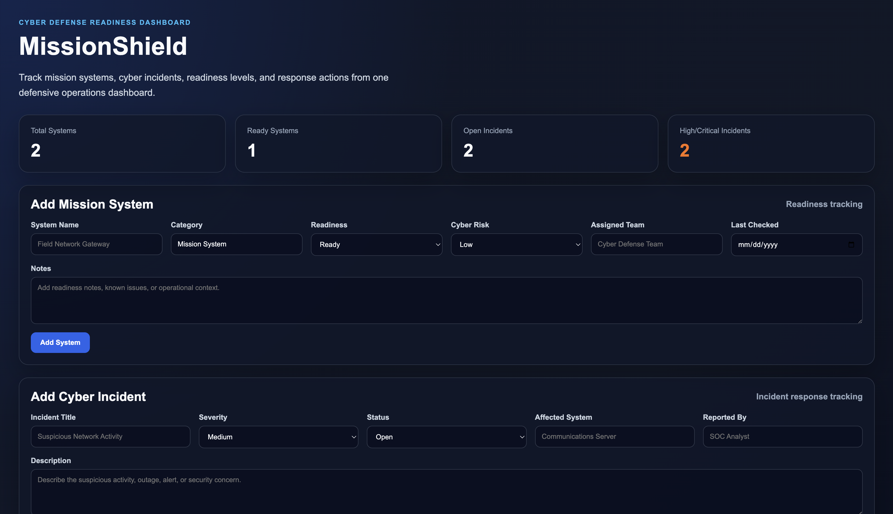
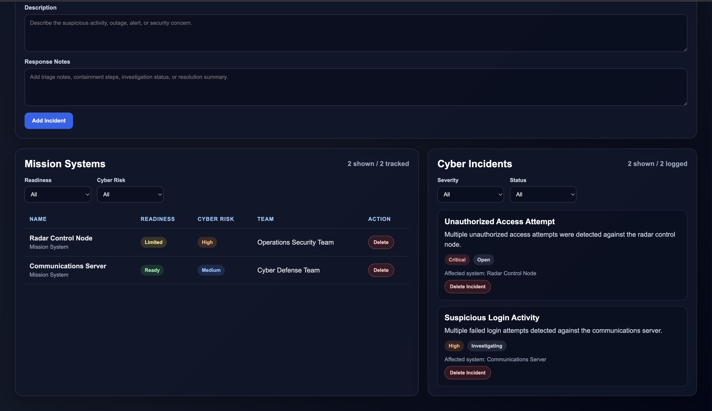

# MissionShield

**Cyber Defense Readiness Dashboard**

MissionShield is a defense-style cybersecurity operations dashboard built with **React**, **Node.js**, **Express**, and **SQLite**. It helps track mission system readiness, cyber incidents, severity levels, operational risk, and response actions from a single dashboard.

---

# Screenshots

## Dashboard Overview



## Systems and Incidents View



---

# Project Highlights

- Defense-style cyber readiness dashboard
- React frontend with dark operations-style UI
- Node.js and Express backend API
- SQLite database storage
- Mission system readiness tracking
- Cyber incident reporting
- Dashboard summary cards
- System and incident filtering
- Severity and status tracking
- Full-stack JavaScript project

---

# Features

- Track mission systems and readiness status
- Add and delete mission systems from the dashboard
- Track cyber incidents and response notes
- Add and delete cyber incidents from the dashboard
- View total systems, ready systems, open incidents, and high-risk incidents
- Filter systems by readiness and cyber risk
- Filter incidents by severity and status
- Store systems and incidents in SQLite
- Display live backend data in a React dashboard
- REST API integration between frontend and backend

---

# Tech Stack

- React
- JavaScript
- Node.js
- Express.js
- SQLite
- HTML
- CSS
- Git/GitHub

---

# Project Structure

```text
missionshield/
├── backend/
│   ├── database.js
│   ├── server.js
│   ├── package.json
│   └── package-lock.json
│
├── frontend/
│   ├── src/
│   │   ├── App.jsx
│   │   ├── App.css
│   │   ├── index.css
│   │   └── main.jsx
│   ├── package.json
│   └── vite.config.js
│
├── README.md
└── .gitignore
```

---

# Backend API

The backend runs on:

```text
http://localhost:5002
```

## Routes

```text
GET    /                     API health check
GET    /api/summary          Dashboard summary data
GET    /api/systems          List mission systems
POST   /api/systems          Create a mission system
DELETE /api/systems/:id      Delete a mission system
GET    /api/incidents        List cyber incidents
POST   /api/incidents        Create a cyber incident
DELETE /api/incidents/:id    Delete a cyber incident

```

---

# Database Tables

MissionShield uses SQLite with two main tables:

## Systems

Stores mission system readiness data:

- System name
- Category
- Readiness status
- Cyber risk level
- Assigned team
- Last checked date
- Notes
- Created timestamp

## Incidents

Stores cyber incident data:

- Incident title
- Description
- Severity
- Status
- Affected system
- Reported by
- Response notes
- Created timestamp

---

# Running the Project

## Backend

```bash
cd backend
npm install
npm run dev
```

Backend runs at:

```text
http://localhost:5002
```

## Frontend

Open a second terminal:

```bash
cd frontend
npm install
npm run dev
```

Frontend runs at:

```text
http://localhost:5173
```

---

# Example Mission Systems

```text
Communications Server
Readiness: Ready
Cyber Risk: Medium
Assigned Team: Cyber Defense Team
```

```text
Radar Control Node
Readiness: Limited
Cyber Risk: High
Assigned Team: Operations Security Team
```

---

# Example Cyber Incidents

```text
Suspicious Login Activity
Severity: High
Status: Investigating
Affected System: Communications Server
```

```text
Unauthorized Access Attempt
Severity: Critical
Status: Open
Affected System: Radar Control Node
```

---

# Current Capabilities

- Backend API with Express
- SQLite database persistence
- React dashboard frontend
- Mission system creation and deletion
- Cyber incident creation and deletion
- Dashboard summary cards
- System readiness filtering
- Cyber risk filtering
- Incident severity filtering
- Incident status filtering
- Live data refresh after form submission and delete actions

---

# Roadmap

- Edit mission systems
- Edit cyber incidents
- CSV export for systems and incidents
- Printable incident reports
- Dashboard charts
- Search by system name or incident title
- Authentication and role-based access
- Deployment-ready configuration

---

# Author

**D'Andre Knight**

Computer Science graduate focused on software engineering, cybersecurity, artificial intelligence, automation, and defense-oriented technology.

GitHub: https://github.com/dandrek123

LinkedIn: www.linkedin.com/in/d’andre-knight-358836251
